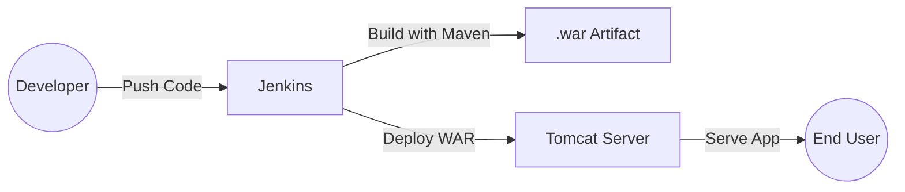

# Jenkins + Tomcat Deployment with Terraform


This project provisions a custom AWS networking environment with Jenkins and Tomcat servers using Terraform, and sets up a CI/CD pipeline to build and deploy a sample Java web application.

## Features

- **Infrastructure as Code (IaC)** with Terraform  
  - Custom VPC, subnets, and security groups  
  - EC2 instances for Jenkins (CI/CD) and Tomcat (App hosting)  

- **CI/CD Pipeline**  
  - Jenkinsfile defines build & deploy stages  
  - Maven builds the app into a `.war` file  
  - Artifact deployed automatically to Tomcat server  

- **Sample WebApp**  
  - Simple Java WAR application to demonstrate pipeline execution

## Repository Structure
```bash
.
├── Scripts/               # Bootstrap scripts for Jenkins & Tomcat setup
├── compute.tf             # EC2 definitions (Jenkins & Tomcat servers)
├── main.tf                # Root Terraform config
├── network.tf             # Custom VPC, subnets, route tables, SGs
├── outputs.tf             # Terraform outputs
├── variables.tf           # Input variables (no hardcoding)
├── Jenkinsfile            # CI/CD pipeline for Jenkins
└── SampleWebApp/          # Java WAR app for deployment demo
```

## Architecture Overview



## Prerequisites
Before deployment, ensure you have:
- An **AWS account** with permissions to create VPC, EC2, Security Groups
- **Terraform** installed locally
- An existing **SSH key pair** in AWS
- Ubuntu **22.04 AMI** available in your target AWS region
- Basic knowledge of **Jenkins pipeline**

## How to Use

### Provision Infrastructure

```bash
terraform init
terraform apply --auto-approve
```
 This creates networking, Jenkins server, and Tomcat server.

### Access Jenkins
- URL: http://`<jenkins-public-ip>`:8080  
- Unlock Jenkins with the initial admin password (`/var/lib/jenkins/secrets/initialAdminPassword`) 

### Run Pipeline
- Defined in `Jenkinsfile`  
- Builds SampleWebApp → packages as `.war` → deploys to Tomcat

### Access Application
- Visit: http://`<tomcat-public-ip>`:8080/`<your-app-name>`


## License

- This project is licensed under the MIT License — See the 'LICENSE' file for full details.   